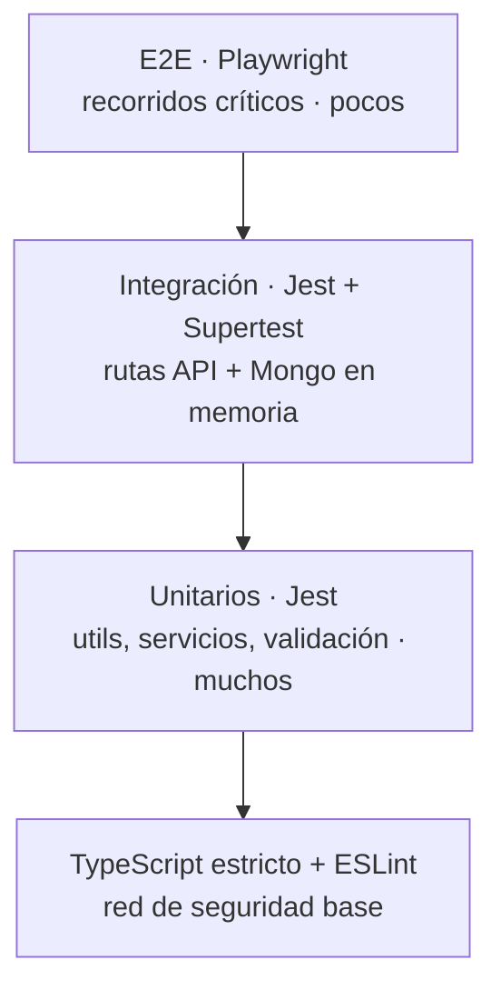
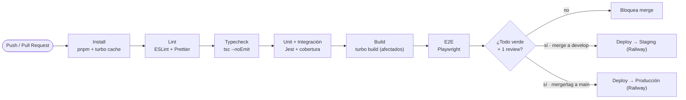
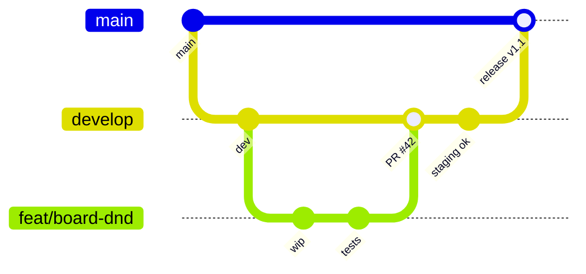

# YourVivac — Lógica de negocio, testing y workflow

Qué hace cada funcionalidad, cómo se prueba y cómo se contribuye. El manual operativo para construir YourVivac de forma consistente: casos de uso, tests (Jest + Playwright), CI/CD y el flujo para añadir features.

> **Trío de guías.** Esta cierra el set: *Diseño* (UI/tokens) · *Desarrollo* (stack/modelo/endpoints) · *Agregador* (scraping) · y esta, la **lógica + calidad + workflow**. Los casos de uso se derivan del diseño ya existente; afina cada regla durante la implementación.

---

## 1. Cómo usar esta guía

Cada funcionalidad se piensa primero como **caso de uso** (actor · entrada · reglas · salida · errores) y solo después se escribe código.

1. **Pensar** — define el caso de uso y el contrato (types + validación) antes de tocar lógica.
2. **Construir** — backend (modelo→servicio→ruta) y frontend (sdk→store→componente) con tests.
3. **Entregar** — PR → pipeline verde → review → merge → despliegue automático.

---

## 2. Reglas de negocio transversales

Aplican a toda la plataforma. Cualquier caso de uso las hereda.

### Roles y permisos

| Rol | Puede |
|---|---|
| `user` | Crear y unirse a salidas, pinear, listas, publicar consejos, seguir, comentar. |
| `guide` | Todo lo de `user` + badge verificado + ofrecer ayuda para montar salidas. Rol **aditivo**, concedido por admin. |
| `admin` | Panel: verificar guías, moderar reportes/contenido, gestionar usuarios, ver analíticas. |

### Autorización por pertenencia y propiedad
- **Pertenencia** — el contenido de una salida (tablero, chat, pines, mensajes) solo es accesible para sus `members`.
- **Propiedad** — editar/eliminar una salida = `owner`; editar/eliminar un pin o lista = su `author/owner` (el owner de la salida puede moderar su tablero).
- **Visibilidad** — `public` aparece en Explorar y en el perfil; `private` solo para miembros/seguidos según el recurso.

### Consistencia de datos
- **Contadores denormalizados** (`stats`, `counts`) se actualizan en la misma operación que el dato; reconciliables por un job.
- **Idempotencia** — invitar, seguir y dar like son idempotentes (repetir no duplica).
- **Borrado suave** — mensajes y contenido moderable usan `deletedAt`, no borrado físico.
- **Validación en dos capas** — Zod en el request (forma) + validadores de Mongoose (invariantes de dominio).

---

## 3. Casos de uso por dominio

Derivados de las pantallas del diseño. Formato uniforme: **actor**, **entrada**, **reglas/lógica**, **devuelve**, **errores**.

### Autenticación

**UC-A1 · Acceder con Google**
- **Actor:** Visitante.
- **Entrada:** `POST /auth/google` con el `idToken` de Firebase obtenido en cliente.
- **Lógica:**
  - Verifica el token con `firebase-admin`; extrae email, nombre y foto.
  - *Find-or-create* por email. Si ya existe con proveedor `password`, **enlaza** el proveedor Google (no duplica cuenta).
  - Emite `access` (~15 min) y `refresh` (~30 d, persistido en `sessions`, cookie httpOnly en web).
  - Usuario nuevo → `role:'user'`, settings por defecto, `emailVerified:true`.
- **Devuelve:** `{ user, accessToken }` (+ cookie refresh). `201` si nuevo, `200` si existente.
- **Errores:** 401 token inválido/expirado · 403 cuenta `banned`.

### Salidas

**UC-T1 · Crear una salida**
- **Actor:** Usuario autenticado.
- **Entrada:** `POST /trips` · título, fechas, lugar (coords+placeId), dificultad, visibilidad.
- **Lógica:**
  - Crea el `trip` con `owner = req.user` y lo añade a `members` con rol `owner` y rsvp `going`.
  - Inicializa el **tablero** (vacío) y el **chat** del grupo; `status:'planning'`.
  - `slug` único a partir del título; valida `endDate ≥ startDate`.
- **Devuelve:** `201` con el trip creado.
- **Errores:** 422 validación · 401 sin auth.

**UC-T2 · Invitar amigos**
- **Actor:** Owner o miembro.
- **Entrada:** `POST /trips/:id/invite` · lista de `userId` o handles.
- **Lógica:** Verifica pertenencia. Añade miembros con rsvp `invited` (idempotente). Emite notificación `trip_invite` (worker + email opcional).
- **Devuelve:** `200` con la lista de miembros actualizada.
- **Errores:** 403 no eres miembro · 404 usuario no existe.

**UC-T4 · Completar salida**
- **Actor:** Owner.
- **Lógica:**
  - `status → 'completed'`, fija `completedAt`.
  - Incrementa `stats` de cada miembro `going` (trips, vivacs si hay pernocta, km, desnivel).
  - Genera `activity:'trip_completed'` → feed de "tu cordada" (UC-H1).
  - Evalúa logros (achievements) por umbrales.
- **Devuelve:** `200` trip actualizado.
- **Errores:** 403 no owner · 409 ya completada.

### Tablero y pines

**UC-B1 · Añadir un pin**
- **Actor:** Miembro de la salida.
- **Entrada:** `POST /trips/:id/pins` · `type` + payload según tipo + `layout`.
- **Lógica:**
  - Valida pertenencia. Valida el payload del **tipo** (discriminated union en Zod).
  - `note/text`: sanea markdown. `link`: hace *unfurl*. `photo`: usa media ya subida (UC-M1). `list`: referencia una `gearList` propia. `map`: guarda coords+placeId.
  - Persiste, incrementa `trip.stats.pinCount` y **emite por Socket.IO** a la sala del trip.
- **Devuelve:** `201` con el pin; los demás miembros lo reciben en tiempo real.
- **Errores:** 403 no miembro · 422 payload inválido para el tipo.

**UC-B2 · Mover / editar un pin**
- **Actor:** Autor del pin u owner de la salida.
- **Entrada:** `PATCH /pins/:id` · `layout` (x, y, rotación, z) y/o contenido.
- **Lógica:** Actualiza posición o contenido; emite el cambio por socket (movimiento = evento ligero, con throttle en cliente).
- **Devuelve:** `200` pin actualizado.
- **Errores:** 403 sin permiso.

### Listas de equipo y productos

**UC-G2 · Buscar producto y añadirlo a una lista**
- **Actor:** Dueño de la lista.
- **Entrada:** `GET /products/search?q=&stores=` → elige producto → `POST /gear-lists/:id/items`.
- **Lógica:**
  - La API hace de **proxy** al agregador (Cordal) con la API key; nunca scrapea ella misma.
  - Al añadir el ítem, guarda `product { storeKey, title, url, price, currency, externalId }` y recalcula `totalWeight`.
- **Devuelve:** `200` resultados agrupados (search) · `201` ítem añadido (con peso total recalculado).
- **Errores:** 502/207 si el agregador da resultado parcial (`partial`) · 403 no eres el dueño.

### Consejos · perfil · admin (resumen)

| Caso | Regla núcleo | Devuelve |
|---|---|---|
| **UC-P1** Publicar consejo | Markdown saneado; `draft`→`published` fija `publishedAt`; pasa por moderación. | 201 tip |
| **UC-P2** Like / comentar | Idempotente; actualiza `counts`; notifica al autor. | 200 |
| **UC-H1** Feed de inicio | Lee `activities` de a quién sigues + propias, por recencia; respeta visibilidad. | 200 feed paginado |
| **UC-U2** Solicitar guía | Crea `guideApplication` `pending` + sube documentos; notifica a admin. | 201 solicitud |
| **UC-AD1** Verificar guía | Admin aprueba→`user.role='guide'` + `guide.verifiedAt`; rechaza→motivo. Notifica al solicitante. | 200 |
| **UC-AD2** Resolver reporte | Cambia `report.status`; puede ocultar contenido o suspender usuario. | 200 |
| **UC-M1** Subir imagen | Sharp optimiza→Cloudinary; crea `media` `pending`; worker modera y aprueba/oculta. | 201 media |

---

## 4. Máquinas de estado

Los estados explícitos evitan datos ambiguos. Transiciones permitidas:

**Salida (`trip.status`)**
```
planning → confirmed → completed
   ↘ cancelled (desde cualquiera salvo completed)
```

**RSVP de miembro**
```
invited → going | maybe | declined
going ⇄ maybe ⇄ declined (editable)
```

**Solicitud de guía**
```
pending → in_review → approved
                    ↘ rejected
```

**Consejo (`tip.status`)**
```
draft → published → archived
published → (moderación) removed
```

---

## 5. Estrategia de testing

Pirámide clásica: **muchos** unitarios rápidos, **algunos** de integración, **pocos** E2E sobre los recorridos críticos. TypeScript estricto como primera red de seguridad.



| Nivel | Herramienta | Qué cubre |
|---|---|---|
| Unitario | Jest + ts-jest | Funciones puras (`utils`), servicios con repos mockeados, esquemas Zod. |
| Integración | Jest + Supertest + mongodb-memory-server | Endpoints reales contra Mongo en memoria: auth, guards de permiso, casos de uso. |
| Componentes | Vitest/RTL (web) | Render y comportamiento de componentes clave. |
| E2E | Playwright | Recorridos completos en navegador real sobre la web. |

**Cobertura y datos:** umbral de cobertura en lógica de dominio (`services/`, `utils/`): **≥ 80%**. Datos de test mediante **factories** (no fixtures rígidos). Cada test es independiente y limpia su estado.

---

## 6. Tests unitarios — Jest

El grueso de la confianza. Rápidos, sin red ni base de datos real. Viven junto al código (`*.test.ts`).

```ts
// utils/gear.test.ts — función pura, fácil de fijar
import { totalWeight } from './gear';

describe('totalWeight', () => {
  it('suma el peso de los ítems en gramos', () => {
    const items = [{ weightGrams: 1180 }, { weightGrams: 480 }];
    expect(totalWeight(items)).toBe(1660);
  });
  it('ignora ítems sin peso', () => {
    expect(totalWeight([{ weightGrams: 100 }, {}])).toBe(100);
  });
});
```

```ts
// services/trip.service.test.ts — repos mockeados
it('al completar, incrementa stats de los miembros going', async () => {
  const repo = makeTripRepoMock();
  const svc = createTripService({ repo, activities: mockActivities });
  await svc.complete(tripId, ownerId);
  expect(repo.bumpMemberStats).toHaveBeenCalledWith(tripId, expect.any(Object));
  expect(mockActivities.create).toHaveBeenCalledWith(
    expect.objectContaining({ type: 'trip_completed' })
  );
});
```

**Qué probar por capa:**
- **utils** — entradas/salidas y casos límite (peso, slug, fingerprint, formato de unidades).
- **validation** — cada esquema Zod acepta lo válido y rechaza lo inválido (incluida la unión discriminada de pines).
- **services** — reglas de negocio con dependencias mockeadas (permisos, transiciones de estado, idempotencia).

---

## 7. Tests E2E — Playwright

Pocos, pero protegen los recorridos que **no pueden romperse**. Corren contra un entorno efímero (web + API + Mongo de test) levantado en CI.

**Recorridos críticos a cubrir:**

| Journey | Pasos |
|---|---|
| Acceso | Login (Google mockeado) → aterriza en Inicio. |
| Crear y poblar salida | Crear salida → invitar → abrir tablero → añadir pin de nota y de lista. |
| Lista de equipo | Buscar producto (agregador mockeado) → añadir ítem → ver peso total. |
| Consejo | Publicar consejo en Markdown → aparece en el feed de Consejos. |
| Admin | Solicitar guía → admin aprueba → badge de guía visible en el perfil. |

```ts
// e2e/create-trip.spec.ts
test('crear salida y añadir un pin de nota', async ({ page }) => {
  await loginAs(page, 'marcos');
  await page.getByRole('button', { name: 'Nueva salida' }).click();
  await page.getByLabel('Nombre de la salida').fill('Vivac en el Aneto');
  await page.getByRole('button', { name: 'Continuar al tablero' }).click();
  await page.getByRole('button', { name: 'Añadir pin' }).click();
  await page.getByText('Nota').click();
  await expect(page.getByTestId('board')).toContainText('Nota');
});
```

Marca elementos con `data-testid` estables. Los servicios externos (Firebase, agregador, Cloudinary) se **mockean** en E2E para que sean deterministas.

---

## 8. Pipeline CI/CD

Con **GitHub Actions** + caché de **Turborepo** (solo se reconstruye/prueba lo afectado: `turbo run --filter=...[origin/main]`). Cada PR pasa por la misma puerta de calidad.



| Etapa | Falla si… |
|---|---|
| `lint` | Hay errores de ESLint o formato no aplicado. |
| `typecheck` | `tsc` encuentra cualquier error de tipos. |
| `test` | Falla un test o la cobertura baja del umbral. |
| `build` | No compila alguna app/package afectado. |
| `e2e` | Se rompe un recorrido crítico. |

---

## 9. Ramas y contribución

Modelo **trunk-based** con ramas de feature cortas: `main` = producción, `develop` = staging, y `feat/*` · `fix/*` que se integran por PR.



**Convenciones:**
- **Conventional Commits**: `feat:`, `fix:`, `chore:`, `test:`…
- Ramas: `feat/<scope>-<desc>`, cortas y enfocadas.
- Una PR = un cambio coherente; descripción + captura/preview si toca UI.

**Reglas de PR:**
- CI verde obligatorio + **1 review** mínimo.
- Sin bajar cobertura; sin `any` nuevos sin justificar.
- Actualiza contratos compartidos (types/validation/sdk) si el endpoint cambia.
- Squash merge con mensaje convencional.

---

## 10. Cómo añadir una funcionalidad

El camino que recorre **cualquier** feature, de la idea al despliegue.

1. **Define el caso de uso** — actor · entrada · reglas · devuelve · errores (formato de la sección 3). Sin esto, no se escribe código.
2. **Actualiza los contratos** — tipos en `@yourvivac/types`, esquema Zod en `@yourvivac/validation` y función en `@yourvivac/sdk`. Fuente única para front y back.
3. **Backend: modelo → servicio → ruta** — ajusta el modelo Mongoose si hace falta, escribe la lógica en el servicio (con sus reglas), exponla en una ruta con validación y guards de permiso. Tests unitarios + integración.
4. **Frontend: sdk → store → componente** — consume el SDK con TanStack Query, conecta el store de Zustand si hay estado de UI, y construye el componente con la convención de `styles` + tokens. Reusa en web y móvil lo posible.
5. **E2E si es recorrido crítico** — añade o amplía un spec de Playwright para el journey afectado.
6. **PR → pipeline → review → deploy** — abre la PR; pasa la puerta de calidad; review; merge a `develop` (staging) y, en release, a `main` (producción).

---

## 11. Despliegue y DevOps

### Entornos

| Entorno | Rama | Uso |
|---|---|---|
| **local** | `feat/*` | Desarrollo. Mongo/Redis locales o de dev en Railway; servicios externos mockeados o sandbox. |
| **staging** | `develop` | Espejo de producción en Railway. Donde se valida antes de release y corren los E2E de humo. |
| **producción** | `main` | Despliegue automático en merge/tag. Datos reales. |

### Prácticas
- **Secretos** en variables de Railway por entorno (nunca en el repo). Paridad entre staging y prod.
- **Migraciones** de datos versionadas (p. ej. `migrate-mongo`), ejecutadas en el deploy.
- **Healthchecks** (`/health`) en API, workers y agregador; Railway reinicia si fallan.
- **Observabilidad**: logs estructurados con Pino + (opcional) seguimiento de errores (Sentry). Métricas del agregador por tienda.
- **Rollback**: redeploy de la versión anterior en Railway; releases etiquetadas para volver atrás.
- **Imagen del agregador**: build Docker con navegadores de Playwright (ver guía de Cordal).

---

## 12. Definition of Done

- [ ] Caso de uso documentado (actor/entrada/reglas/salida/errores).
- [ ] Contratos actualizados (types · validation · sdk).
- [ ] Validación de request (Zod) + guards de permiso.
- [ ] Tests unitarios e integración pasando.
- [ ] E2E del journey (si crítico).
- [ ] Sin errores de tipos ni de lint; cobertura no baja.
- [ ] UI fiel a tokens y convención de componentes.
- [ ] Funciona en web y móvil (si aplica).
- [ ] Estados y contadores consistentes.
- [ ] PR con review aprobada y CI verde.

> **Set completo.** Con las cuatro guías —Diseño, Desarrollo, Agregador y esta de Lógica/Testing/Workflow— un equipo o agente tiene el qué, el cómo, el con-qué y el cómo-se-trabaja para construir YourVivac de extremo a extremo.
