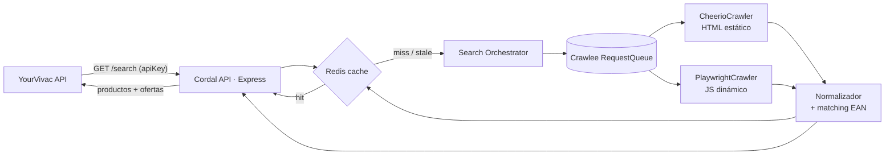
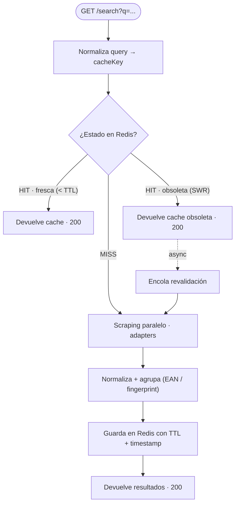
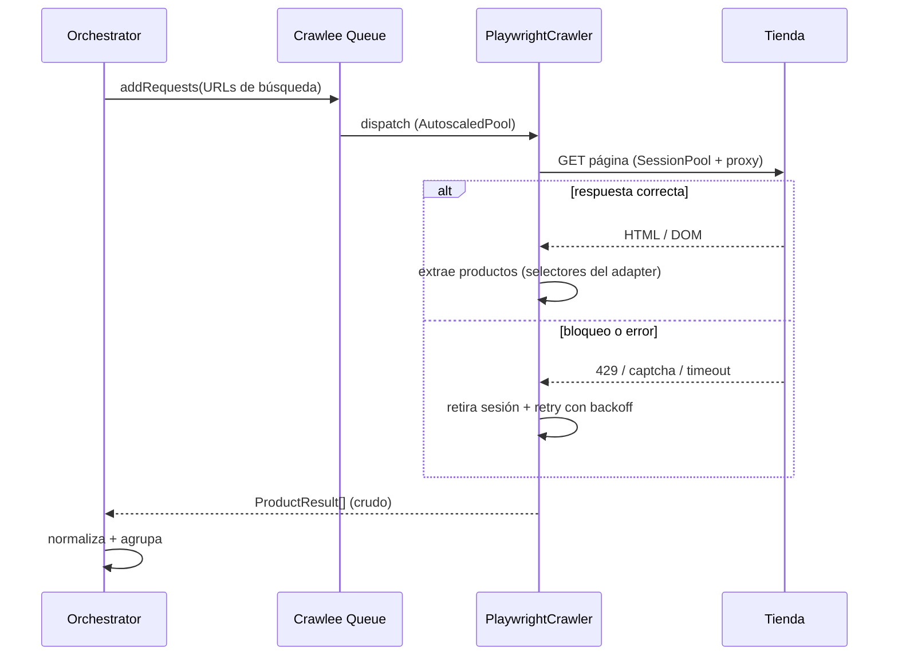
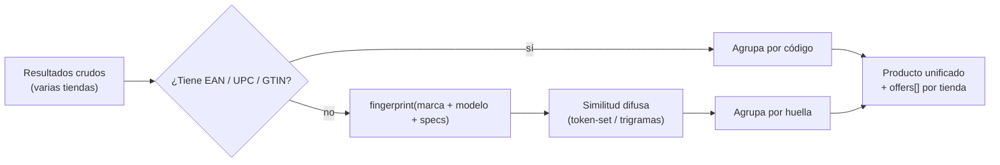

# Cordal — Agregador de tiendas (guía técnica)

> **Repositorio aparte:** `vivac-aggregator`. *"Cordal"* es el nombre de trabajo del servicio (línea de cumbres de una sierra). Renómbralo libremente.

El motor de búsqueda agregada de material de montaña que alimenta las listas de equipo de YourVivac. Consulta varias tiendas a la vez, normaliza y agrupa productos, y lo sirve con caché propia.

> **Relación con YourVivac.** Vive en su **propio repositorio** (módulo core, candidato a abrirse a contribuidores) pero se despliega en el **mismo proyecto de Railway**. La API principal lo consume como **proxy** (`GET /products/search` → Cordal). Aquí solo se documenta el servicio.

---

## 1. Qué es y por qué va aparte

Cordal expone una **API de consultas agregadas**: dado un término ("saco de dormir -5"), busca en varias tiendas (generales y especializadas de montaña), normaliza cada resultado a una forma común, agrupa las ofertas del mismo producto y devuelve todo cacheado.

**Por qué un repositorio separado:**

*Aislamiento*
- El scraping es **frágil**: cambia con el HTML de cada tienda. Aislarlo evita arrastrar a la API principal.
- Ciclo de vida y despliegue propios; puede escalar y caerse sin tumbar YourVivac.
- Caché y cola propias (Redis), independientes del resto.

*Comunidad*
- Es un **módulo core** reutilizable, candidato a **open source**.
- El patrón de *adapters* permite que contribuidores añadan tiendas sin tocar el núcleo.
- Contrato de API estable hacia YourVivac aunque el interior cambie.

---

## 2. Postura legal y ética del scraping

El diseño asume una práctica **responsable**. Los tres niveles de riesgo:

| Nivel | Situación | Postura de Cordal |
|---|---|---|
| **1 · Datos públicos** | Leer páginas públicas (nombre, precio, imagen, valoración). | **Permitido** — es el modo de operación. |
| **2 · Términos de servicio** | Muchas tiendas prohíben el scraping automatizado; pueden bloquear IP/cuenta. | **Mitigar** — preferir APIs oficiales; ritmo bajo y respetuoso. |
| **3 · Eludir medidas técnicas** | Romper CAPTCHAs, saltar anti-bot, credenciales robadas, zonas privadas. | **Prohibido** — fuera del alcance del proyecto. |

**Reglas de juego (built-in):** limitar la frecuencia por dominio · respetar `robots.txt` cuando sea razonable · no generar carga excesiva · cachear de forma agresiva para minimizar peticiones · aportar valor (comparativa, no copia) · **preferir APIs oficiales** cuando existan · identificarse con un `User-Agent` honesto.

> Esto es una guía técnica, no asesoría legal. La viabilidad depende de la jurisdicción y de los términos de cada tienda; conviene revisarlos por comercio antes de activarlo en producción.

---

## 3. Stack del servicio

| Pieza | Elección | Por qué |
|---|---|---|
| Lenguaje | TypeScript + Node | Coherencia con el resto del proyecto. |
| API | Express | Capa fina: search / product / stores / health. |
| **Scraping** | Crawlee | Framework completo: cola, autoescalado, reintentos, `SessionPool`, rotación de proxies. Envuelve Playwright y Cheerio. |
| Navegador | PlaywrightCrawler | Tiendas con render en cliente (JS): espera contenido, clics, scroll. |
| HTML estático | CheerioCrawler | Tiendas que sirven HTML ya renderizado: más rápido y barato. |
| Caché | Redis (ioredis) | Resultados por consulta/tienda con TTL + stale-while-revalidate. |
| Persistencia (opc.) | PostgreSQL o Mongo | Catálogo normalizado e histórico de precios si crece. |
| Cola de refresco | Crawlee RequestQueue / BullMQ | Revalidación en background y crawls programados. |
| Validación | Zod | Normaliza y valida la salida de cada adapter. |
| Empaquetado | Docker | Imagen con navegadores de Playwright; desplegada en Railway. |

**¿Por qué Crawlee y no Playwright a secas?** Playwright abre el navegador, pero no gestiona **cola, reintentos, concurrencia, sesiones ni proxies**. Crawlee añade todo eso encima y deja elegir motor por tienda (Cheerio para estáticas, Playwright para dinámicas) con la misma API.

---

## 4. Arquitectura general

La API de YourVivac nunca scrapea: delega en Cordal, que decide entre caché y scraping y devuelve una respuesta normalizada.



---

## 5. Ciclo de una petición

1. **Entrada** — `GET /search?q=&stores=&limit=` autenticado con API key interna.
2. **Clave de caché** — se normaliza la query (minúsculas, sin acentos, orden de tiendas) → `cacheKey`.
3. **Decisión** — según el estado de la caché: *hit fresca*, *hit obsoleta* (SWR) o *miss*.
4. **Scraping** (si hace falta) — Crawlee lanza los adapters seleccionados en paralelo.
5. **Normalización + matching** — forma común y agrupación por producto.
6. **Persistencia en caché** — guarda con TTL y devuelve.

---

## 6. Caché — hit / miss / stale-while-revalidate

La caché es el corazón del servicio: minimiza peticiones a las tiendas (respeto + velocidad). Se usa **stale-while-revalidate**: si la entrada está obsoleta pero existe, se devuelve al instante y se revalida en segundo plano.



### Política de TTL (orientativa)

| Dato | TTL fresco | Ventana SWR |
|---|---|---|
| Resultados de búsqueda | 15–30 min | hasta 2–6 h |
| Detalle de producto / precio | 30–60 min | hasta 12 h |
| Lista de tiendas / estado | varios días | — |

Claves sugeridas: `search:{hash(query+stores)}` · `product:{store}:{externalId}`. Guardar siempre `fetchedAt` para calcular frescura.

---

## 7. Crawlee a fondo

Crawlee orquesta el scraping. Funciones que aprovecha Cordal:

- **RequestQueue** — cola de URLs a visitar (búsqueda → fichas), con deduplicación.
- **AutoscaledPool** — ajusta la concurrencia según CPU/memoria y respuesta de la web.
- **SessionPool** — rota sesiones/cookies y descarta las "quemadas" (bloqueos).
- **ProxyConfiguration** — rotación de proxies por dominio para repartir carga.
- **Reintentos + backoff** — reintenta fallos transitorios (429/timeout) con espera creciente.
- **Router + handlers** — etiqueta peticiones (LIST / DETAIL) y enruta a su handler.

### Secuencia de un scrape



---

## 8. Adaptadores por tienda

Cada tienda es un **adapter** autónomo que implementa una interfaz común. Añadir un comercio = añadir un archivo, sin tocar el núcleo. Cada adapter declara su motor (Cheerio o Playwright) y sus selectores.

```ts
// providers/decathlon.ts
import { StoreAdapter, ProductResult } from '../core/types';

export const decathlon: StoreAdapter = {
  key: 'decathlon',
  engine: 'cheerio',        // o 'playwright' si renderiza en cliente
  baseUrl: 'https://www.decathlon.es',
  rateLimit: { perMinute: 20 },  // cortesía por dominio

  async search(query, ctx): Promise<ProductResult[]> {
    // 1. construye URL de búsqueda  2. ctx.$ (Cheerio) o ctx.page (Playwright)
    // 3. extrae name, price, image, url, ean?  4. return crudo
  },

  async getProduct(externalId, ctx): Promise<ProductDetail> { /* ficha */ },
};
```

**Tiendas objetivo (v1):** Amazon · Decathlon · Deporvillage · Barrabés · Forum Sport · Coleman.

Preferir la **API oficial** cuando la tienda la ofrezca (p. ej. Amazon Product Advertising API); en ese caso el adapter usa `engine: 'api'` y no scrapea.

---

## 9. Normalización y matching de productos

> **El verdadero reto no es el scraping.** Es el **matching**: saber que "Saco Trangoworld Winter -5" y "Trangoworld Saco de dormir Winter -5ºC" son el **mismo producto**. El 80% del esfuerzo de un comparador está aquí.



**Pipeline:**
1. **Normaliza** cada resultado a la forma común (`ProductResult`): nombre limpio, precio numérico + moneda, imagen, URL, tienda, EAN si aparece.
2. **Identidad fuerte** — si hay `EAN/UPC/GTIN`, es la clave de agrupación fiable.
3. **Identidad débil** — sin código: genera `fingerprint` (marca + modelo + atributos) y compara con similitud difusa.
4. **Agrupa** en un producto con `offers[]` (una por tienda) ordenadas por precio.

```ts
// Salida agrupada
{
  product: "Trangoworld Saco Winter -5°C",
  brand: "Trangoworld",
  ean: "8433849123456",
  image: "https://...",
  offers: [
    { store: "decathlon", price: 119.0, currency: "EUR", url: "..." },
    { store: "barrabes",  price: 129.0, currency: "EUR", url: "..." }
  ]
}
```

---

## 10. Resiliencia y monitorización

Los scrapers **se rompen** cuando una tienda cambia el HTML. El diseño asume el fallo y lo aísla por tienda.

*Aislamiento de fallos:*
- Si un adapter falla, los demás siguen — la respuesta es parcial, no un error total.
- Cada respuesta indica `partial: true` y qué tiendas fallaron.
- *Circuit breaker* por tienda: si falla repetidamente, se desactiva temporalmente.

*Salud y alertas:*
- `GET /stores` reporta estado por adapter (ok / degradado / caído).
- Validación Zod: si la forma cambia, el adapter marca "esquema roto".
- Métricas: tasa de éxito, latencia y bloqueos por dominio.

---

## 11. Endpoints

API mínima y estable. Toda petición lleva la **API key interna** (`x-api-key`) que comparte con YourVivac.

- `GET /search?q=&stores=&limit=` — búsqueda agregada (cacheada, productos agrupados).
- `GET /product/:store/:externalId` — detalle normalizado de un producto.
- `GET /stores` — tiendas soportadas + estado de salud.
- `POST /refresh` *(interno)* — fuerza revalidación de una query/producto.
- `GET /health` — healthcheck (Railway).

### Forma de la respuesta de `/search`

```ts
{
  query: "saco -5",
  stores: ["decathlon", "barrabes"],
  cached: true,
  partial: false,
  fetchedAt: "2026-06-13T08:42:00Z",
  results: [ /* productos agrupados con offers[] */ ]
}
```

---

## 12. Despliegue y entorno

```
Railway (mismo proyecto que YourVivac)
├─ cordal-api          Express + Crawlee (Docker con navegadores Playwright)
├─ cordal-worker       revalidación de caché + crawls programados (opc.)
└─ Redis               caché + cola (puede ser el mismo Redis del proyecto)

Repo aparte: vivac-aggregator
└─ Dockerfile basado en la imagen de Playwright (navegadores incluidos)
```

### Variables de entorno

| Variable | Uso |
|---|---|
| `PORT` | Puerto del servicio. |
| `API_KEY` | Clave compartida con la API de YourVivac (`x-api-key`). |
| `REDIS_URL` | Caché + cola. |
| `DATABASE_URL` | Persistencia opcional (catálogo / histórico de precios). |
| `PROXY_URL` / `PROXY_GROUPS` | Proxies para rotación (Crawlee). |
| `USER_AGENT` | UA honesto e identificable. |
| `CACHE_TTL_SEARCH` · `CACHE_TTL_PRODUCT` | TTL configurables. |
| `MAX_CONCURRENCY` | Tope del AutoscaledPool. |
| `AMAZON_API_KEY` · ... | Credenciales de APIs oficiales por tienda (si aplica). |

---

## 13. Checklist del servicio

**Núcleo:**
- [ ] Repo `vivac-aggregator` + Dockerfile (Playwright).
- [ ] API Express: search / product / stores / health.
- [ ] Auth por `x-api-key`.
- [ ] Caché Redis con TTL + SWR.

**Scraping:**
- [ ] Crawlee: RequestQueue + AutoscaledPool + SessionPool.
- [ ] Interfaz `StoreAdapter` + adapters v1.
- [ ] Cheerio para estáticas, Playwright para dinámicas.
- [ ] Reintentos, backoff y rotación de proxies.

**Datos:**
- [ ] Normalización a `ProductResult` (Zod).
- [ ] Matching por EAN + fingerprint difuso.
- [ ] Agrupación en producto + `offers[]`.

**Operación:**
- [ ] Circuit breaker + respuestas parciales.
- [ ] `/stores` con estado de salud.
- [ ] Métricas y alertas por tienda.
- [ ] Preferir APIs oficiales donde existan.
